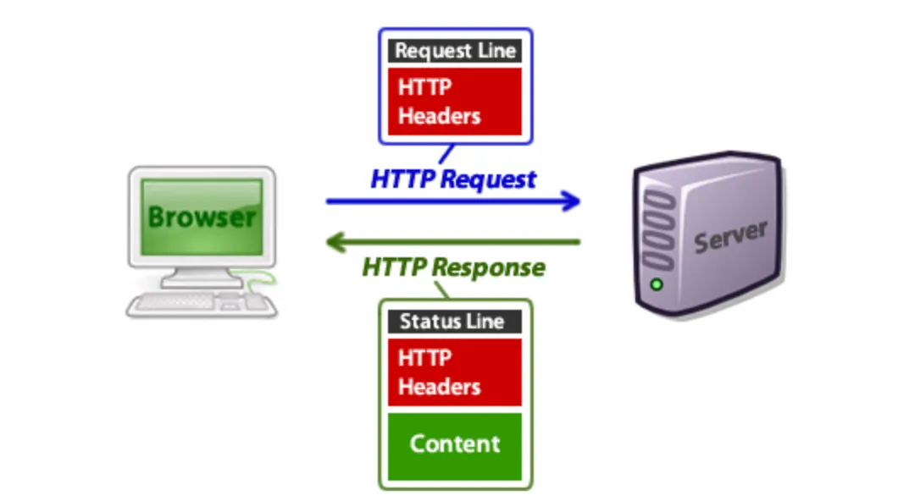

### 1. ¿Qué es un Servidor Web?

Un servidor web es un software que se ejecuta en un servidor físico y maneja las solicitudes de los usuarios entrantes. Su función principal es entregar páginas web a los navegadores de los usuarios.

### Principales Servidores Web

1. **Apache HTTP Server**:
   - **Lanzamiento**: 1995
   - **Características**: Código abierto, flexible, ampliamente utilizado.
   - **Uso**: Popular en servidores Linux.

2. **Nginx**:
   - **Lanzamiento**: 2004
   - **Características**: Alto rendimiento, escalabilidad, ideal para sitios de alta concurrencia.
   - **Uso**: Creciente popularidad en grandes empresas.

3. **Microsoft IIS (Internet Information Services)**:
   - **Lanzamiento**: 1995
   - **Características**: Integración con Windows, soporte para aplicaciones .NET.
   - **Uso**: Común en entornos empresariales que utilizan tecnología Microsoft.

### Comparación de Servidores Web

| Característica       | Apache          | Nginx           | Microsoft IIS  |
|----------------------|-----------------|-----------------|----------------|
| **Código Abierto**   | Sí              | Sí              | No             |
| **Rendimiento**      | Bueno           | Excelente       | Bueno          |
| **Escalabilidad**    | Media           | Alta            | Media          |
| **Compatibilidad**   | Multiplataforma | Multiplataforma | Windows        |

### 2. ¿Qué es HTTP?

HTTP (HyperText Transfer Protocol) es el protocolo utilizado para la transferencia de datos en la web. Define cómo se formatean y transmiten los mensajes, y cómo los servidores y navegadores deben responder a diversas solicitudes.

### Ciclo de una Petición HTTP

1. **Cliente (Navegador)**: Envía una solicitud HTTP al servidor.
2. **Servidor Web**: Recibe la solicitud, procesa la información y envía una respuesta.
3. **Cliente (Navegador)**: Recibe la respuesta y muestra la página web.

### Ejemplo de Petición y Respuesta HTTP

**Petición HTTP:**
```
GET /index.html HTTP/1.1
Host: www.ejemplo.com
```

**Respuesta HTTP:**
```
HTTP/1.1 200 OK
Content-Type: text/html

<html>
<body>
<h1>¡Hola, mundo!</h1>
</body>
</html>
```

### Gráfico del Ciclo de Petición-Respuesta HTTP



### 3. ¿Qué es un Servidor en la Nube (Cloud Server)?

Un servidor en la nube es una infraestructura física o virtual que entrega aplicaciones, procesa información o proporciona almacenamiento de datos. Los servidores en la nube se crean utilizando software de virtualización, que divide un servidor físico en varios servidores virtuales⁴⁵.

### Beneficios de los Servidores en la Nube

- **Escalabilidad**: Permiten ajustar los recursos según las necesidades.
- **Rentabilidad**: Solo se paga por lo que se usa, reduciendo costos de mantenimiento.
- **Flexibilidad**: Se pueden configurar y desplegar rápidamente en cualquier parte del mundo.

### Comparación entre Servidores Locales y en la Nube

| Característica       | Servidor Local  | Servidor en la Nube |
|----------------------|-----------------|---------------------|
| **Costo Inicial**    | Alto            | Bajo                |
| **Mantenimiento**    | Requiere personal| Mínimo              |
| **Escalabilidad**    | Limitada        | Alta                |
| **Accesibilidad**    | Local           | Global              |


### Videos recomendados

1. [Error 404](https://www.youtube.com/watch?v=6jKkd3buI0o)
2. [HTTPs](https://www.youtube.com/watch?v=60606AHuq8c)
3. [Qué es la WEB?](https://www.youtube.com/watch?v=kXhXgcVpAU8)
4. [¿Qué es HTML?](https://youtu.be/tPzq8IufGxE?si=zfcltlgAmOBp5SRB) 
5. [Pagina, sitio y app Web](https://www.youtube.com/watch?v=BUyaHveV9rY)


#### ¿Cómo saber en qué servidor está alojada una web?

> cURL -I http://www.motores.com/

> https://check-host.net/

### cURL

`curl` (Client URL) es una herramienta (programa) de línea de comandos utilizada para transferir datos desde o hacia un servidor mediante URLs. Es muy versátil y soporta una amplia variedad de protocolos, incluyendo HTTP, HTTPS, FTP, FTPS, SCP, SFTP, y más.

### Características Principales de `curl`

- **Portabilidad**: Funciona en casi todos los sistemas operativos y dispositivos conectados.
- **Compatibilidad con Múltiples Protocolos**: Soporta protocolos como HTTP, HTTPS, FTP, SMTP, y más.
- **Versatilidad**: Puede realizar solicitudes GET, POST, PUT, DELETE, entre otras.
- **Depuración**: Proporciona detalles de lo que se ha enviado y recibido, útil para depuración.
- **Uso en Scripts**: Ideal para automatizar tareas en scripts de shell.

### Ejemplos de Uso de `curl`

1. **Enviar una Petición GET**:
   ```bash
   curl -X GET http://www.ejemplo.com/index.html
   ```

2. **Enviar una Petición POST**:
   ```bash
   curl -X POST -d "nombre=Juan&apellido=Pérez" http://www.ejemplo.com/formulario
   ```

3. **Ver Cabeceras de Respuesta**:
   ```bash
   curl -I http://www.ejemplo.com/index.html
   ```

4. **Descargar un Archivo**:
   ```bash
   curl -O http://www.ejemplo.com/archivo.zip
   ```

### Actividad Práctica

- Abrir la terminal (cmd), crear la carpeta curl en  'C:\Users\PcXX\Documents\'
- Entrar a la carpeta y practicar los siguientes comandos. 

1. **wttr.in**: Muestra información meteorológica directamente en la terminal. Puedes probar con:
   ```bash
   curl wttr.in
   ```

2. **cheat.sh**: Proporciona "hojas de trucos" para comandos de Linux y otros temas. Por ejemplo:
   ```bash
   curl cheat.sh/curl
   ```

3. **httpbin.org**: Un servicio que te permite probar diferentes tipos de solicitudes HTTP y ver las respuestas. Es muy útil para aprender y practicar con `curl`. Ejemplo:
   ```bash
   curl http://httpbin.org/get
   ```

4. **jsonplaceholder.typicode.com**: Un servicio de API falso que puedes usar para probar solicitudes HTTP. Ejemplo:
   ```bash
   curl https://jsonplaceholder.typicode.com/posts
   ```

5. **Analizar Peticiones HTTP con `curl`**:

   - **Enviar una Petición GET**:
     ```bash
     curl -X GET http://www.example.com/index.html
     ```
   - **Enviar una Petición POST**:
     ```bash
     curl -X POST -d "name=Juan" http://www.example.com/form
     ```
   - **Ver Cabeceras de Respuesta**:
     ```bash
     curl -I http://www.example.com/index.html
     ```
   - **Descargar un Archivo**:
     ```bash
     curl -O http://www.example.com/archivo.zip
     ```

---
