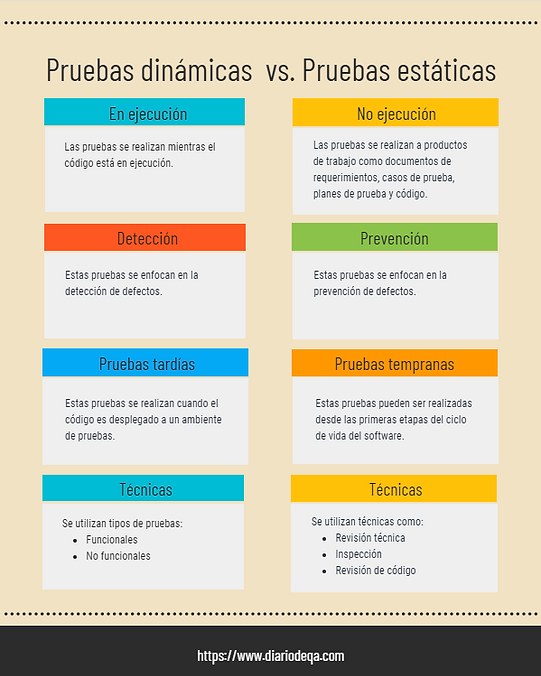

## [Técnicas de Prueba](https://www.youtube.com/watch?v=vq0Hx7A4tmc)

### Pruebas dinámicas vs pruebas estáticas

#### Pruebas dinámicas 

Las pruebas dinámicas son aquellas que se realizan mientras el código está en ejecución. Tienen como objetivo asegurar que el software se comporte de acuerdo con los requerimientos del negocio mediante la realización de pruebas funcionales y no funcionales.

Estas pruebas se enfocan en la detección y confirmación de la corrección de defectos en el software. Por lo general se realizan en una etapa más tardía que las pruebas estáticas, por lo cual, los defectos encontrados en estas son más costosos. 

#### Pruebas estáticas 

A diferencia de las pruebas dinámicas, estas no requieren de la ejecución de software para ser realizadas. Parte del objetivo de las pruebas estáticas es la revisión de productos de trabajo como documentos de requerimientos, casos de prueba, planes de prueba, código, guías de usuario.

Estas pruebas se enfocan en la prevención de defectos y en la detección temprana de los mismos, ya que se pueden realizar en cualquier étapa del ciclo de vida de software según la información que se tenga disponible.

#### Similitudes

Ambos tipos de prueba buscan el mismo objetivo general, asegurar la calidad del producto. Si bien es cierto que cada uno tiene su momento de aplicación particular, estos dos tipos de pruebas no son contrarios, sino que se complementan el uno a otro.

 

____

Las técnicas de prueba son mecanismos que los testers utilizan con el objetivo de identificar los casos de prueba con mayor probabilidad de encontrar defectos y obtener la mayor cobertura posible en cuanto a las pruebas de algún sistema. 

#### Técnicas de prueba de caja negra

Cuando hablamos de técnicas de caja negra, esto significa que al poner en práctica estas técnicas, solo nos concentraremos en los **datos de entrada** y los **resultados obtenidos** en la prueba, **sin ver la estructura interna** de la funcionalidad.

#### Técnicas de prueba de caja blanca

El objetivo de las pruebas de caja blanca es realizar pruebas que cubran la ****estructura interna de un sistema**, por estructura interna nos referimos a **código, arquitectura y flujos de trabajo**. En las pruebas de caja blanca, el código es visible para los testers, por lo que también se denominan pruebas de caja transparente o pruebas de caja abierta.

La profundidad de las pruebas de caja blanca se puede medir a través de la cobertura estructural. La cobertura estructural es la medida que se utiliza para saber si todas las rutas dentro de un módulo se han ejecutado al menos una vez (Esto será explicado más a detalle en otro artículo acerca de las técnicas de caja blanca). 

##### Para realizar pruebas de caja blanca que sean eficaces se debe poner en práctica lo siguiente:

+ Se debe tener conocimiento del código: Entender el lenguaje de programación de nuestro sistema y lo que realiza el código es imprescindible para realizar pruebas de caja blanca.

+ Crear casos de pruebas confiables: Aunque este tipo de pruebas está relacionado con el funcionamiento interno de la aplicación, **en ninguna circunstancia los casos de prueba se deben basar en lo que vemos del código**. Los casos de prueba deben **basarse en las especificaciones** que ya conocemos, así cuando se ejecuten las pruebas estaremos confiados en que nuestro sistema cumple el apropiado flujo de trabajo y que el código es lógicamente correcto.

##### ¿En qué nos ayudan las pruebas de caja blanca?

Son ideales para detectar: 

+ Rutas rotas o mal estructuradas en el código
+ Errores de lógica en el código
+ Diferencias entre el diseño y la implementación
+ La incorrecta funcionalidad de los bucles y condicionales
+ Fugas de memoria
+ Si la aplicación tiene el rendimiento esperado
+ Fallos en el almacenamiento de datos

##### Tipos de pruebas de caja blanca

Las pruebas de caja blanca más utilizadas son las **pruebas unitarias**, generalmente realizadas por el desarrollador, estas pruebas se enfocan en los componentes, unidades o módulos, es decir, los elementos más pequeños del software. Algunos objetivos de estas pruebas son verificar que los comportamientos funcionales y no funcionales del componente son los diseñados y especificados, encontrar defectos, prevenir la propagación de defectos en otros niveles de prueba.

Es un error muy común es confundir las pruebas de caja blanca con las pruebas estáticas, el objetivo principal de las pruebas de caja blanca es tener una cobertura de la estructura interna de nuestro sistema, mientras que las pruebas estáticas se encargan de la revisión de productos de trabajo como documentos de requerimientos, casos de prueba, planes de prueba, código, guías de usuario, así que aunque realizar Code Review involucra la vista del código, esto no es considerado como una prueba de caja blanca, sino como una prueba estática.

<!--

Referencias: 

https://www.diariodeqa.com/post/proceso-de-pruebas-de-software

https://www.diariodeqa.com/post/pruebas-din%C3%A1micas-vs-pruebas-est%C3%A1ticas

https://www.diariodeqa.com/post/t%C3%A9cnicas-de-prueba-de-caja-blanca

https://www.diariodeqa.com/post/pruebas-de-caja-blanca

https://www.diariodeqa.com/post/tecnicas-de-prueba-de-caja-negra

https://www.diariodeqa.com/post/pruebas-basadas-en-la-experiencia

-->
